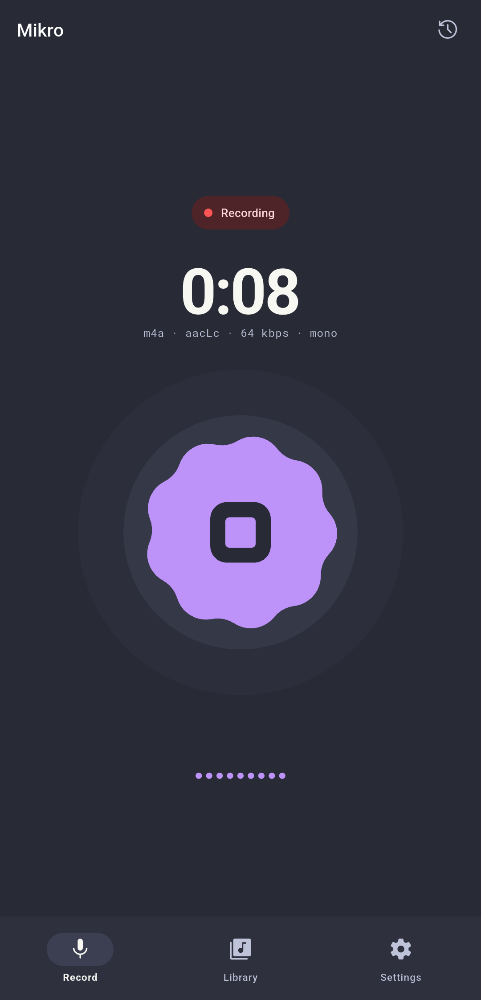
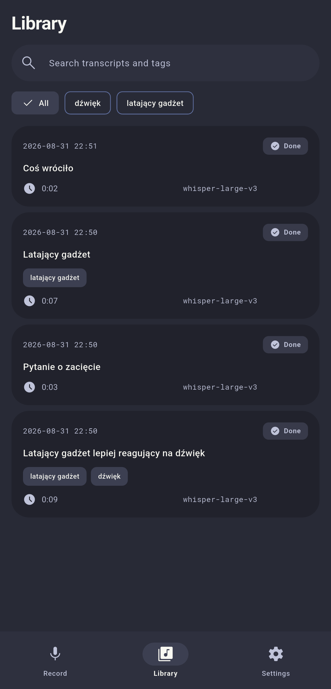
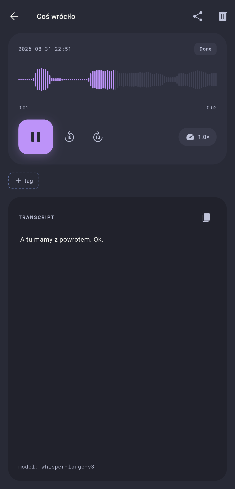
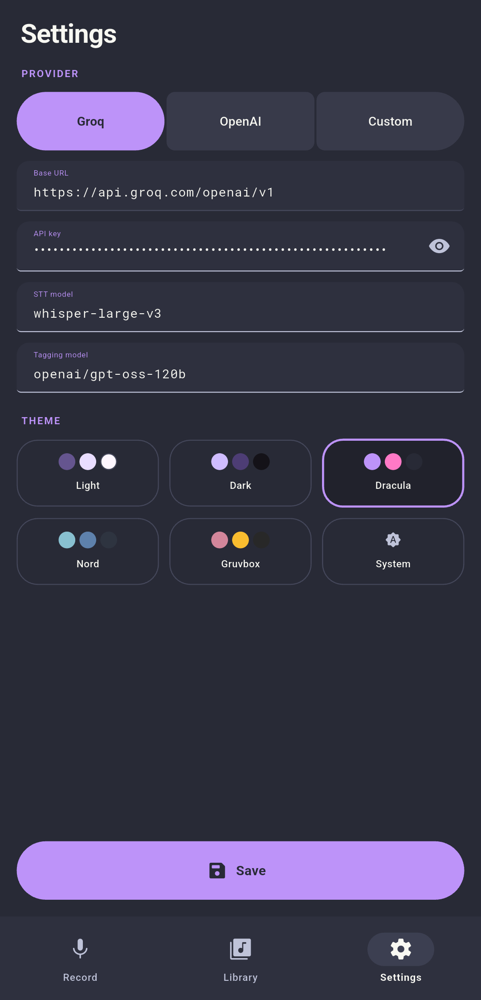
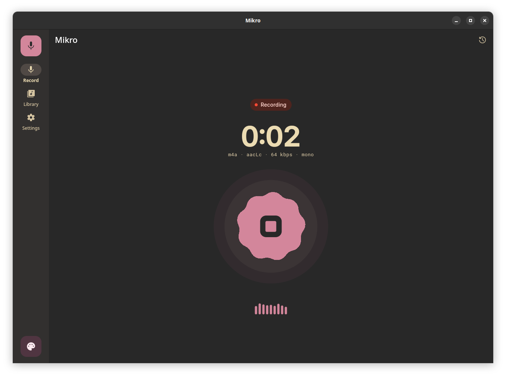
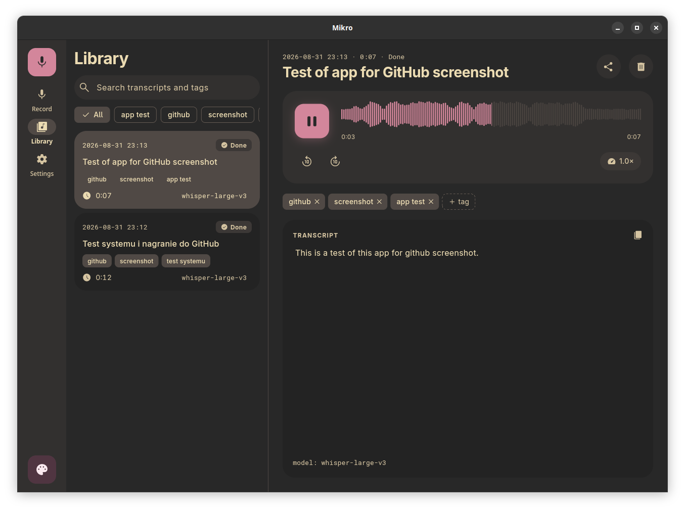

<h1>
  
  Mikro
</h1>

<p>
  <b>Modern voice recorder & AI-powered transcription app for Android and Linux desktop.</b>
</p>

<p>
  Voice recorder for Android and Linux that turns audio recordings into text using OpenAI-compatible transcription and completion APIs. Recordings and data stay local on your device.
</p>

## Download

[](https://apps.obtainium.imranr.dev/redirect?r=obtainium://app/%7B%22id%22%3A%22pl.jmc.mikro%22%2C%22url%22%3A%22https%3A%2F%2Fgithub.com%2Fjmcjm%2Fmikro%22%2C%22author%22%3A%22jmcjm%22%2C%22name%22%3A%22Mikro%22%7D)
[](https://github.com/jmcjm/mikro/releases/latest)

## Screenshots

### Mobile (Android)

<p align="center">
  
  
  
  
</p>

### Desktop (Linux)

<p align="center">
  
  
</p>

## Features

- Microphone recording with live audio level visualization and amplitude waveform capture
- Automatic background transcription immediately after recording completes
- AI-generated title and tags extracted from the transcript using LLM completion
- Recordings library with playback, fuzzy search, and tag filtering
- Manual tag editing and management in recording details
- Offline queue: recordings paused on network errors automatically resume when connectivity returns; auth and rate-limit errors are not retried endlessly
- Multilingual interface (English and Polish), light/dark themes, and Material 3 Expressive design
- Secure API key storage (Android Keystore / Linux Secret Service / libsecret)

## Building

The full toolchain is set up in the devcontainer (`.devcontainer/`) — Flutter, Android SDK, and Linux native libraries are preconfigured. Open the container in any devcontainer-compatible editor or via CLI:

```sh
devcontainer up --workspace-folder .
devcontainer exec --workspace-folder . flutter test
devcontainer exec --workspace-folder . flutter build linux --release
devcontainer exec --workspace-folder . flutter build apk --release
```

Desktop Linux packages are built using the scripts in `packaging/` — both use the same Flutter bundle and shared metadata:

```sh
./packaging/build-flatpak.sh --install
./packaging/build-appimage.sh
```

For packaging details, dependencies, and layout, see [`packaging/README.md`](packaging/README.md).

## CI / CD

Automated builds and GitHub Releases are configured via [GitHub Actions](.github/workflows/build.yml). Pushing a version tag (e.g. `1.0` or `v1.0`) automatically builds and publishes the Android APK, Linux AppImage, and Linux Flatpak packages.

## License

This project is licensed under the [BSD Zero Clause License (0BSD)](LICENSE).

The bundled Roboto Mono typeface (`assets/fonts/`) is licensed under the SIL Open Font License 1.1 — full text is in `assets/fonts/OFL.txt`.

